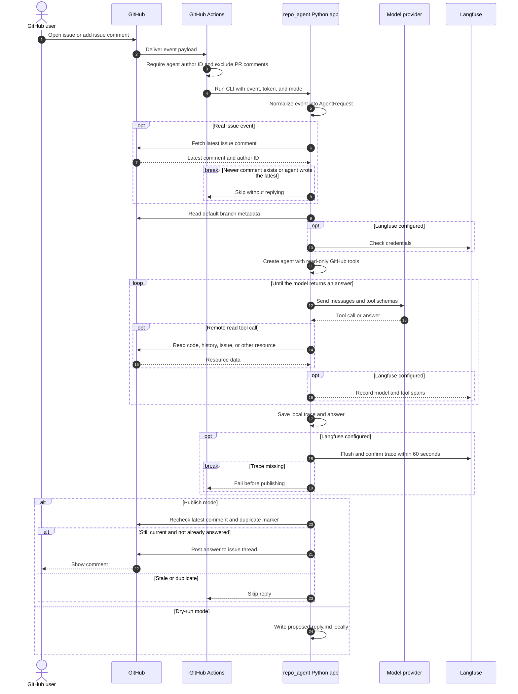

# Repository agent

This directory contains the same Python application used by Actions and local replay. Its tools read repository code, history, and platform resources through remote GitHub APIs. The model can only read; publishing is handled after the agent returns an answer.

## Processing flow



GitHub Actions uploads available replay and debug artifacts after the job. Local replay enters the same Python app with a saved event file. The `.example.json` fixture skips the live latest-comment check because its issue and comment IDs are invented.

## Configure Actions

- Set repository variable `REPO_AGENT_AUTHOR_ID` to the **numeric** GitHub user ID of the account that publishes agent replies. Comments from any other account may trigger the job.
- Set secret `OPENAI_API_KEY`.
- Optionally set `REPO_AGENT_MODEL` (default: `openai:gpt-6-luna`). The default uses OpenAI's Responses API so the model can call repository tools.
- To enable Langfuse, set secrets `LANGFUSE_PUBLIC_KEY` and `LANGFUSE_SECRET_KEY`. Set variable `LANGFUSE_BASE_URL` for your Langfuse region or self-hosted instance; otherwise the SDK uses its default URL. Set both keys or neither.
- The workflow has read access to contents, PRs, discussions, Actions, and checks, and write access to issue replies.
- Workflow code is checked out from the default branch; event content and remote repository resources are treated as data.
- The workflow runs for newly opened issues and new issue comments. It excludes PR conversations. It checks the latest comment before model execution and again before publishing, skipping when a newer comment exists or the agent account wrote the latest comment.
- Replies go to the originating issue thread.
- A hidden event marker prevents duplicate publication on replay.

When Langfuse is configured, the agent sends the full prompt, model, and tool trace through the LangChain callback. It authenticates before model execution, flushes after execution, and waits up to 60 seconds for the trace to appear in Langfuse before publishing. Missing ingestion fails the run and is reported in the Actions log. The local `trace.jsonl` is still saved.

## Local replay

Run from `.github` with a saved GitHub webhook JSON payload:

```sh
export GITHUB_TOKEN=... OPENAI_API_KEY=...
uv sync --frozen
uv run --frozen python -m repo_agent \
  --event-name issue_comment \
  --event-file fixtures/issue-comment.example.json \
  --dry-run --debug
```

- The included fixture uses invented issue/comment IDs and sender ID. The issue API may return 404 during this example replay; the agent can continue by reading repository files.
- Replace the fixture with a saved real event for a faithful replay. The CLI refuses `--publish` with a `.example.json` file. If `REPO_AGENT_AUTHOR_ID` is set locally, use the posting account's numeric ID.
- Use `--publish` only when you intend to post.
- `--output-dir` defaults to `.github/agent-output`, where the process saves `event.json`, `metadata.json` (including default branch SHA and model), `trace.jsonl`, `answer.md`, and, for dry runs, `proposed-reply.md`.
- Keep those files private: they may contain repository or issue content. CI uploads them for seven days.
- Use the same `.github/uv.lock`, model, and event fixture to reproduce a CI run. GitHub data and model responses can still change between runs.
- REST list tools accept `page`, and discussion tools accept GraphQL cursors. Long tool results are returned in character windows with an `offset` argument for subsequent windows.
- The agent can read bounded Actions job logs and text members of artifact ZIPs. Use a token with access to the repository resources you want to inspect; GitHub secrets are never readable as plaintext. Binary files, LFS content, and wiki history need separate access paths.

## Live test

1. Commit and push the `.github` changes to the repository's default branch. In **Settings → Secrets and variables → Actions**, set `OPENAI_API_KEY` as a secret and `REPO_AGENT_AUTHOR_ID` as a variable. The workflow publishes with GitHub's built-in `GITHUB_TOKEN`; get its posting account ID with `gh api 'users/github-actions%5Bbot%5D' --jq .id`. Add both Langfuse secrets and the optional base URL variable if you want to verify remote tracing.
2. Open a new issue from a different account with a concrete question about the repository. This tests the real GitHub event, model, remote read tools, optional Langfuse ingestion, and issue reply in one run. To test the comment path separately, add a new comment to an existing issue. PR comments do not trigger this workflow.
3. Check **Actions → Repository agent** for a successful run and its uploaded `repo-agent-<run id>` artifact. If Langfuse is configured, the log prints the trace ID and the run fails if the trace is not visible within 60 seconds. Confirm that exactly one answer comment appears on the issue.

For a live model and GitHub API test without posting, use the local `--dry-run` command above. The included fixture is synthetic, so its issue lookup may return 404; the run still exercises repository reads and the model.
